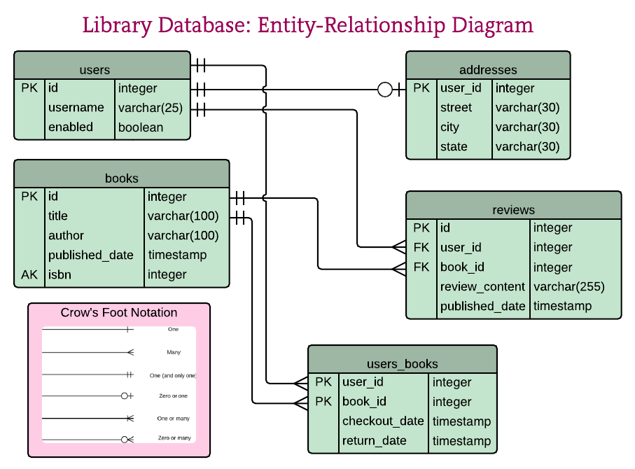

# 1. MySQL


This is the relation model of the MySQL database that you will be pulling data from in the first two assignments. You should have docker & docker-compose (Linux only) installed on your PC in order to be able to get the DB up and running.

To get the database up and running you should run `docker-compose up --build -d`, you should see the containers building & starting. After the container is started you should be able to access the DB through PHPMyAdmin at http://localhost:8081/

The credentials are:
```
host = 127.0.0.1:6033
username = httpool
password = httpool
database = library
```

## 1. Select borrowed book count per city

city | number of books

## 2. List of reviews per selected book (input: book_id)

book_id | title | username | published_date | review_content

# Implement an API proxy

## Working with the API

In the following tasks you will be working with an API, its documentation can be found at
https://openlibrary.org/developers/api

You can use any language you want to accomplish the results.

## 1. Display full book info
Create an endpoint `/book` which returns the formatted results of the following url https://openlibrary.org/api/books?bibkeys=ISBN:9783442236862&jscmd=details&format=json

The book endpoint should output the data in JSON. Field names should be in camel case.

Example:
  - publish_date -> publishDate
  - Image -> image

#### Example response
```json
{
  "image": [
    {
      "thumbnailUrl": "https://covers.openlibrary.org/b/isbn/9783442236862-S.jpg",
      "largeImageUrl": "https://covers.openlibrary.org/b/isbn/9783442236862-L.jpg"
    }
  ],
  "title": "Harry Potter",
  "authors": [
    "Neal Stephenson",
    "J.K Rowling"
  ],
  "publishDate": "2022-05-01",
  "physicalFormat": "Paperback"
}
```

#### Required fields format
```ts
interface Image {
  thumbnailUrl: string
  largeImageUrl: string
}

interface Format {
  title: string
  authors: string[]
  publishDate: string | null // if publishDate is not null it needs to be formatted in ISO 8601
  physicalFormat: string | null
  image: Image[]
}
```

## 2. Title and author search API

- Create an endpoint `/books` which returns a formatted list of books.
  - Fetch details for the first 5 `ISBN` ids of the queried books, if they exist.
- The response format should be list of books in the format shown under "[Example response books](#example-response-books)".
- Implement the **title** and **author** search query parameter.
- Add pagination functionality by adding **limit** and **page** optional parameters to the `/books` endpoint.
   - If no **limit** parameter is in the url query return 10 books by default.
   - If no **page** parameter is in the url query return first page by default.

The search documentation can be found at https://openlibrary.org/dev/docs/api/search.

#### Example response books

```json
[
  {
    "title": "Harry Potter",
    "authors": [
      "Neal Stephenson",
      "J.K Rowling"
    ],
    "details": [
    {
      "isbn": "9783895840432",
      "publishDate": "2022-05-01",
      "physicalFormat": "Paperback",
      "numberOfPages": 254,
      "weight": "1 kg",
      "image": [
        {
          "thumbnailUrl": "https://covers.openlibrary.org/b/id/65413213-S.jpg",
          "largeImageUrl": "https://covers.openlibrary.org/b/id/65413213-L.jpg"
        }
      ]
    }
]
```

#### Required fields format
```ts
interface Image {
  thumbnailUrl: string
  largeImageUrl: string
}

interface Format {
  title: string
  authors: string[]
  details: [
    {
      isbn: string
      publishDate: string | null // if publishDate is not null it needs to be formatted in ISO 8601
      physicalFormat: string | null
      numberOfPages: int | null
      weight: string | null
      image: Image[]
    }
  ]
}
```

## 3. Sorting books
- Implement a **sort** query parameter which can take either **title** or **author** as a value and sorts results accordingly. 
- Provide an option to sort results as **ascending** or **descending** order. Implementation is up to you.
- Only sort the response data on the current page of results.

## 4. Write unit test
- write at least one unit test for your code.
